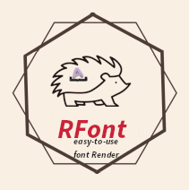
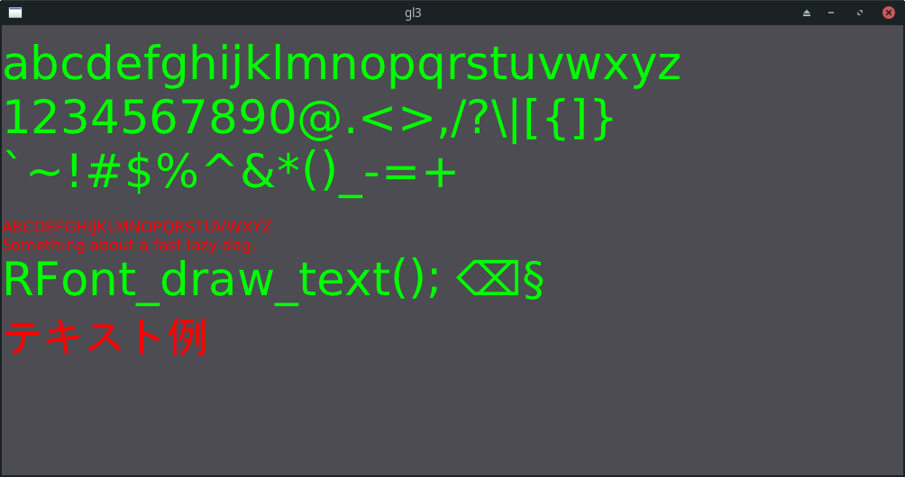

# RFont

Simple single header modular library for font rendering and atlas management.\
The library is designed to be lightweight, `RFont.h` itself does not directly handle rendering calls, it passes raw data to the user defined renderer.

`RFont_gl` and `RFont_gl1` serve as examples of user defined renderers.

RFont is written in Pure C89. It uses `stdint.h` and `inline` by default.

Adding `#define RFONT_C89` will use fallbacks for `stdint.h` and `inline`.

## Build statuses

# Contacts
- email : ColleagueRiley@gmail.com
- discord : ColleagueRiley
- discord server : https://discord.gg/pXVNgVVbvh

# Documentation
For documentation read the `RFont.h` file and check out the example in `./example`

# uses

[A Terminal emulator created using RFont by Noxomix](https://github.com/noxomix/vterm_test)\
[RSGL (my GUI library)](https://github.com/ColleagueRiley/RSGL)

# Credits

# stb_truetype
RFont uses [stb_truetype](https://github.com/nothings/stb) for working with fonts.

A modified version of stb_truetype is included in the RFont header.\
But you can use an external copy by adding `#define RFONT_EXTERNAL_STB` to your code

# Fontstash
[Fontstash](https://github.com/memononen/fontstash) is another font rendering library with simular goals.

Fontash was used as a reference for some of this code.

However, this library is intended to have better perfromance and be more lightweight than fontstash.
